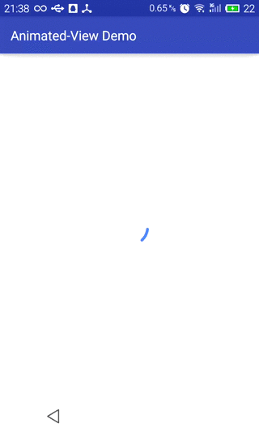

# Animated View

A circular animated style dawable compatible with 3.0


This is how it looks in linear determinate mode:



You can also have a indeterminate or determinate mode if you don't like the animation.

## Usage

You can create your own circular animated drawable in code like this :

```Java
CircularAnimatedDrawable circularAnimatedDrawable = new CircularAnimatedDrawable(getResources().getColor(R.color.colorBar), 12f);
circularAnimatedDrawable.start();
...
circularAnimatedDrawable.stop();
```

### Other options

In case you want the circular animated drawable to change StartAngle or SweepAngle, you can use

```circularAnimatedDrawable.setStartAngle(float startAngle)```

or

```circularAnimatedDrawable.setSweepAngle(float sweepAngle)```.


## Versions

* 1.0 Initial release

License
-------

    Copyright 2015 Jack Han

    Licensed under the Apache License, Version 2.0 (the "License");
    you may not use this file except in compliance with the License.
    You may obtain a copy of the License at

       http://www.apache.org/licenses/LICENSE-2.0

    Unless required by applicable law or agreed to in writing, software
    distributed under the License is distributed on an "AS IS" BASIS,
    WITHOUT WARRANTIES OR CONDITIONS OF ANY KIND, either express or implied.
    See the License for the specific language governing permissions and
    limitations under the License.
